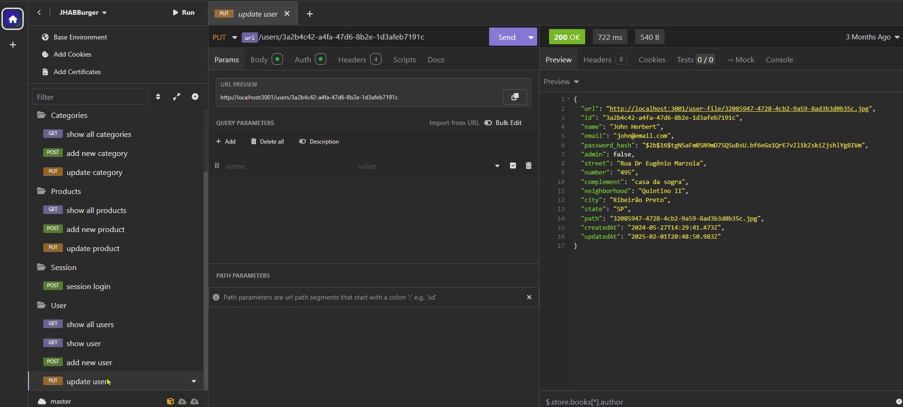

# 🍔 Jhabburger API

API REST construída com Node.js e Express, utilizando o Sequelize ORM para interagir com um banco de dados PostgreSQL e MongoDB. Responsável por gerenciar pedidos, usuários, produtos.

---

<br>

## 📥 Instalação

Siga os passos abaixo para executar o projeto localmente:

  ### 1. Clone o repositório:
  ```bash
  git clone https://github.com/SrBaliardo/metroid-burger.git
  ```

  ### 2. Acesse a pasta do backend
  ```bash
  cd metroid-burger/jhabburger-api
  ```
  
  ### 3. Instale as dependências
   ```bash
  yarn install
  ```

  ### 4. Configure as variáveis de ambiente copiando o arquivo .env-example para .env e ajustando conforme necessário.

  ### 5. Execute as migrações do banco de dados:
  ```bash
  yarn sequelize db:migrate
  ```
  
  ### 6. Inicie o servidor
   ```bash
  yarn dev
  ```
<br>

## 📚 Dependências
- express
- sequelize
- dotenv
- cors

<br>

## 🌐 Repositório
🔗 <a href="https://github.com/SrBaliardo/metroid-burger.git">Repositório completo </a>

<br>

## 🖼️ Fluxo por imagem:<br>
<div>
  
</div>

<br>

🤝 Autor
Desenvolvido por <a href="https://github.com/SrBaliardo">SrBaliardo</a>
