# 🍔 Jhabburger Interface

O **MetroidBurger** é uma aplicação web que simula um sistema de pedidos de hambúrgueres, inspirado no universo de Metroid. O projeto foi criado como parte do curso de formação Fullstack do DevClub, com o objetivo de aplicar conceitos de desenvolvimento web em um contexto lúdico e interativo.

---
<br>

## 📥 Instalação

Siga os passos abaixo para executar o projeto localmente:

  ### 1. Clone o repositório:
  ```bash
 git clone https://github.com/SrBaliardo/metroid-burger.git
  ```

  ### 2. Acesse a pasta do frontend
  ```bash
  cd metroid-burger/jhabburger-interface
  ```
  
  ### 3. Instale as dependências
   ```bash
  yarn install
  ```
  
  ### 4. Inicie o servidor de desenvolvimento
   ```bash
  yarn dev
  ```
<br>

## 📚 Dependências
- React + Vite
- JavaScript
- react-router-dom

<br>

## 🌐 Repositório
🔗 <a href="https://github.com/SrBaliardo/metroid-burger.git">Repositório completo </a>

<br>

## 🖼️ Fluxo por imagens:<br>
<div>
  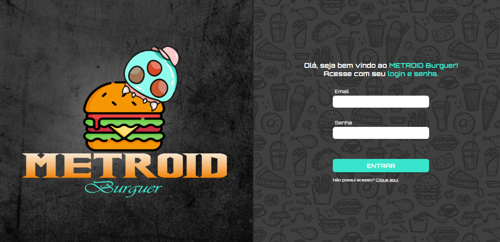
  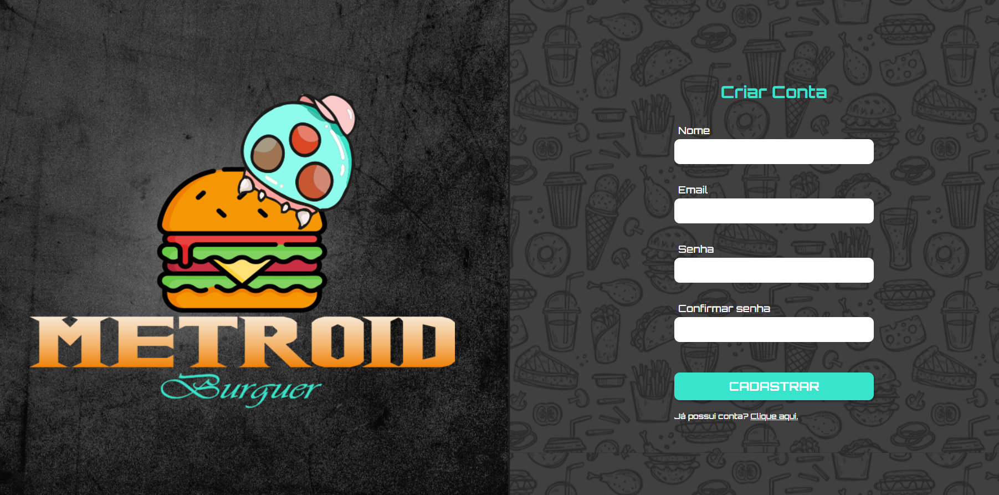
  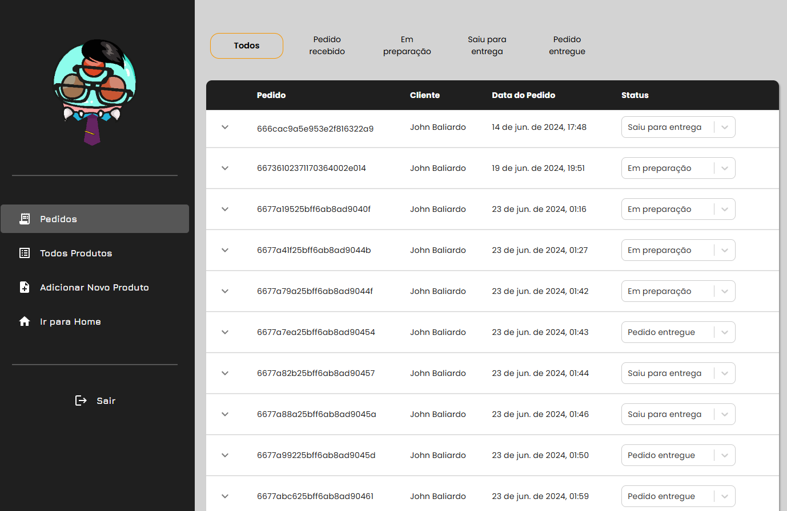
  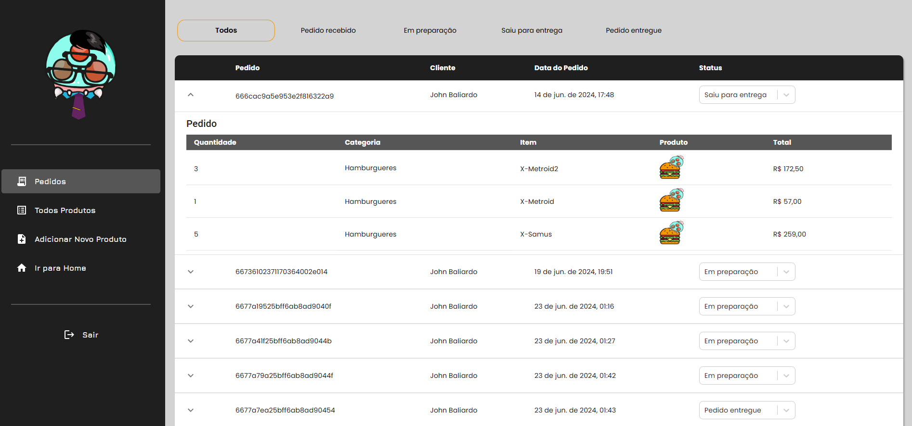
  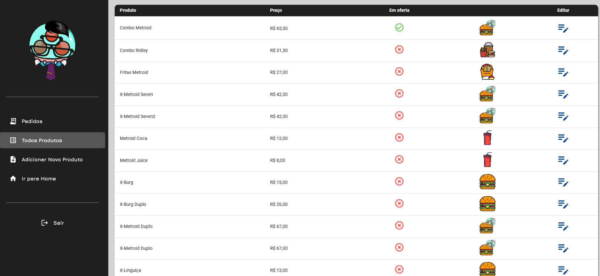
  
  
  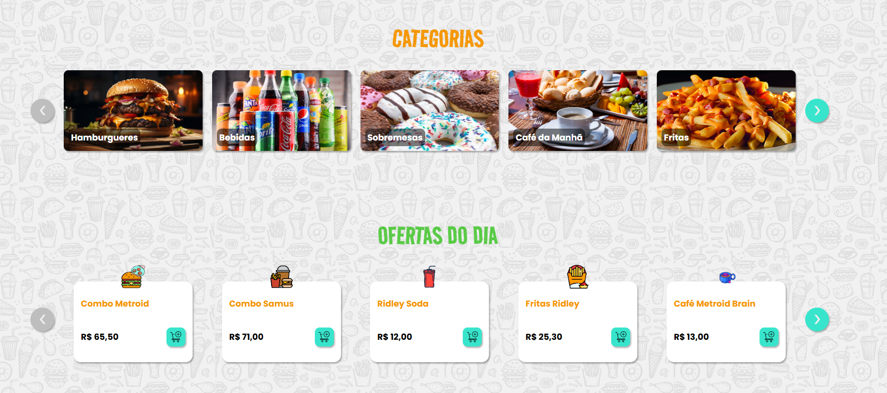
  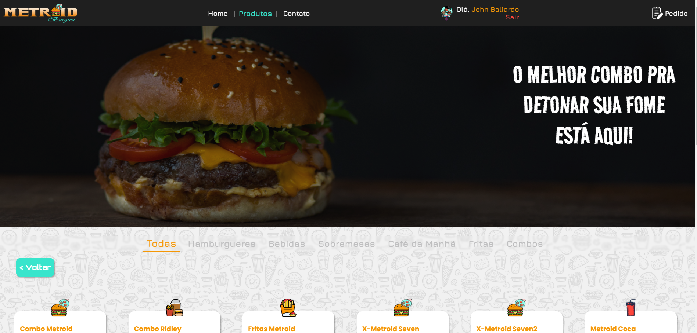
  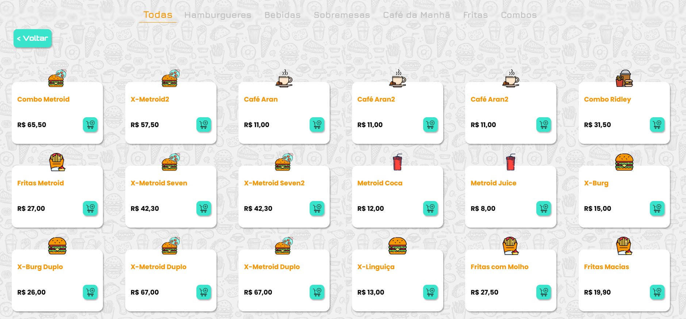
  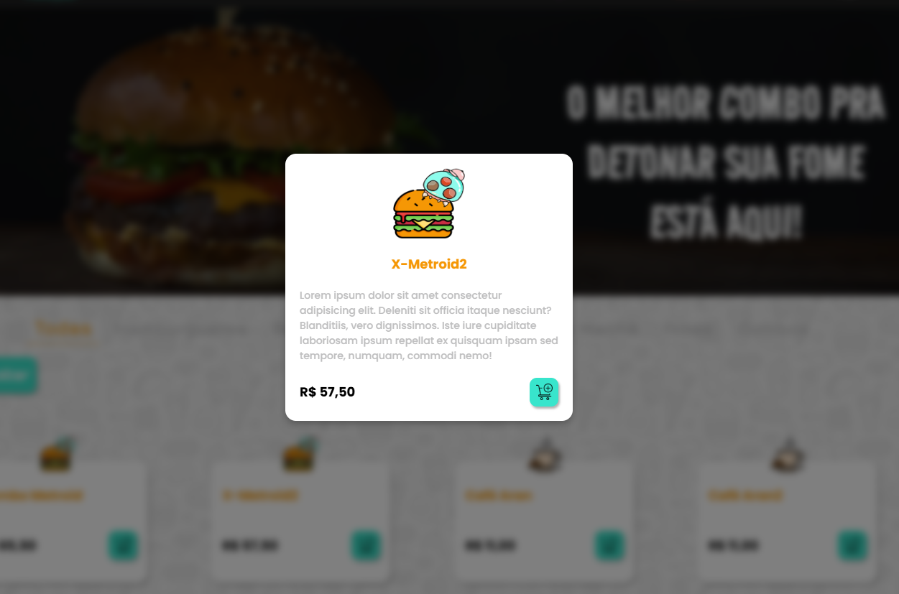
  
  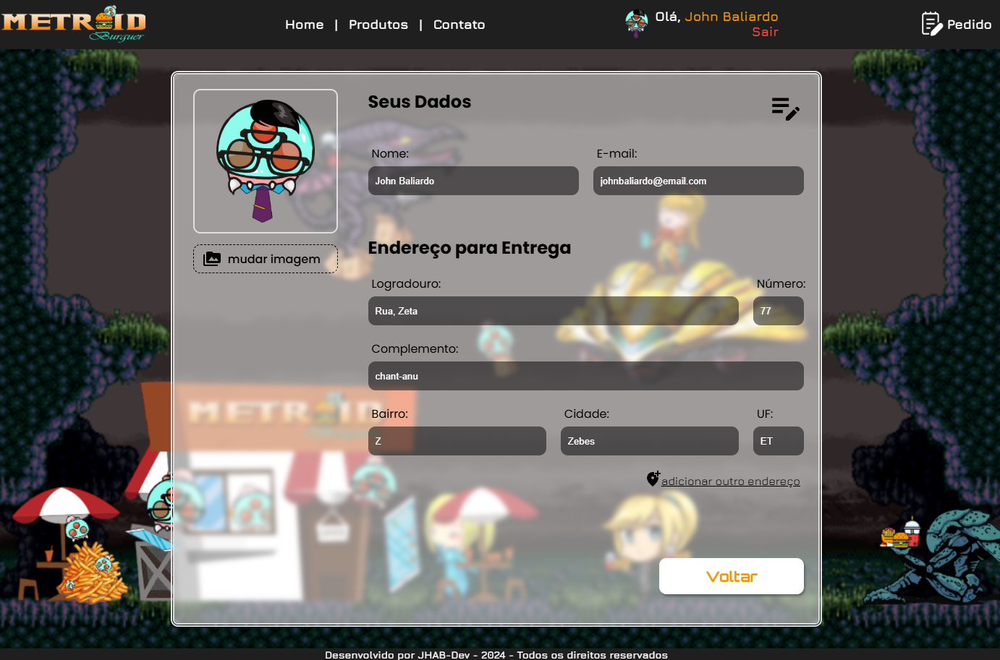
  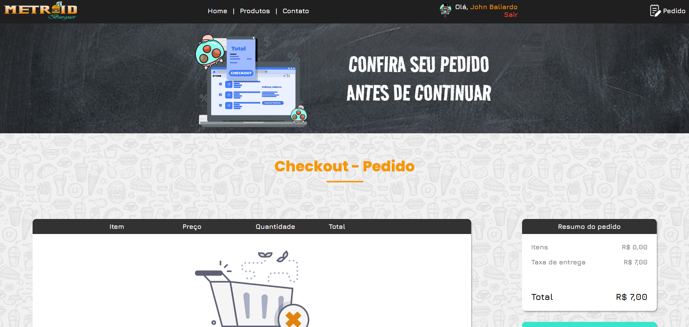
  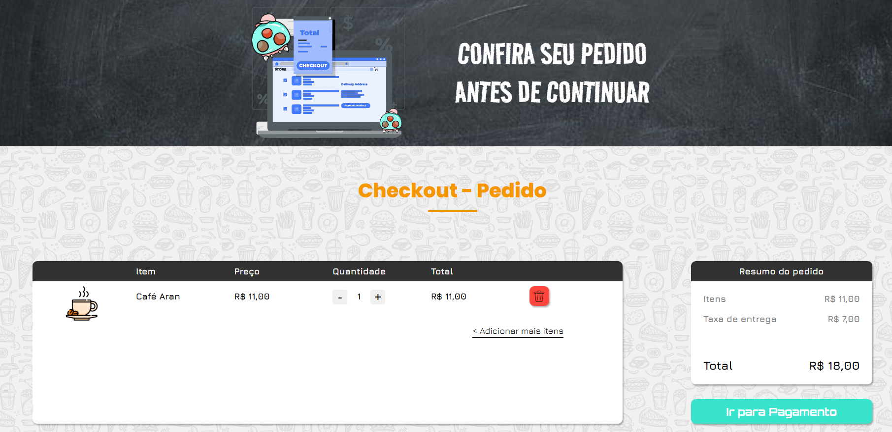
  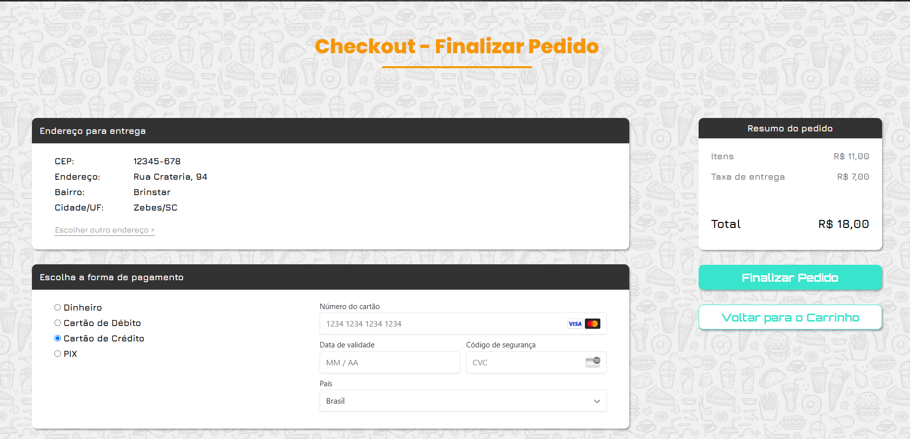
</div>

<br>

🤝 Autor
Desenvolvido por <a href="https://github.com/SrBaliardo">SrBaliardo</a>
